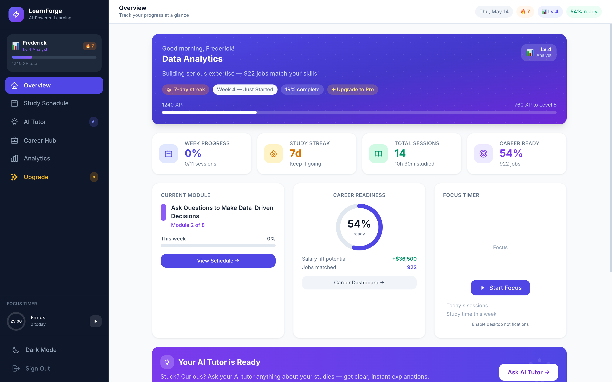
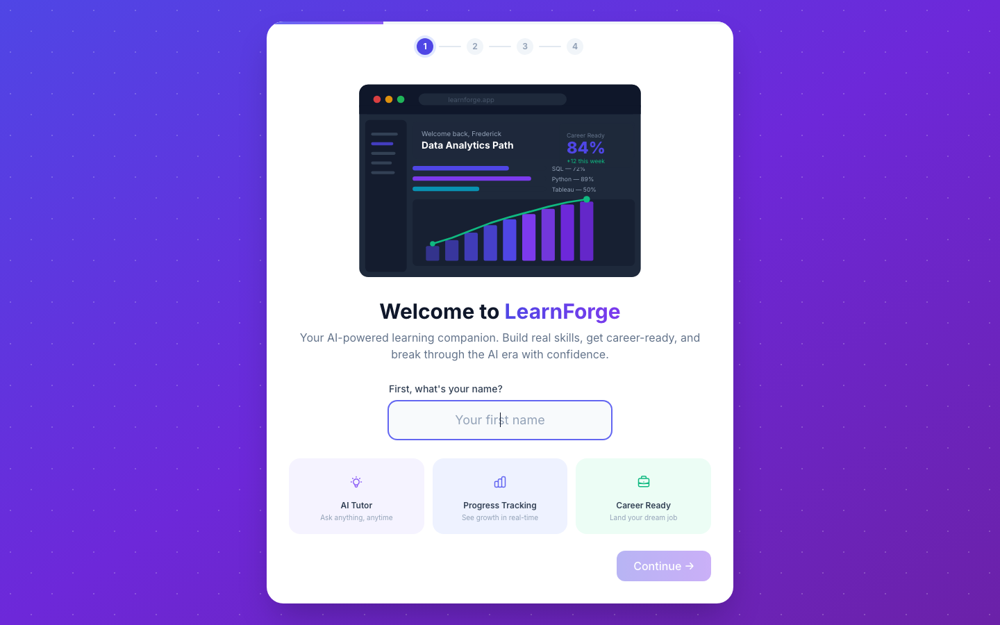
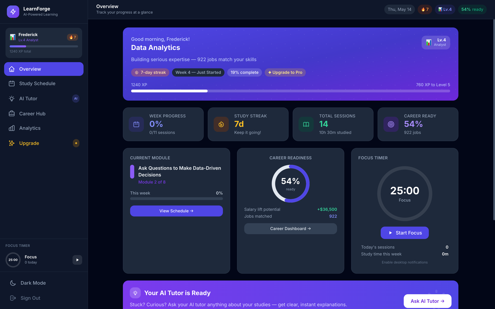
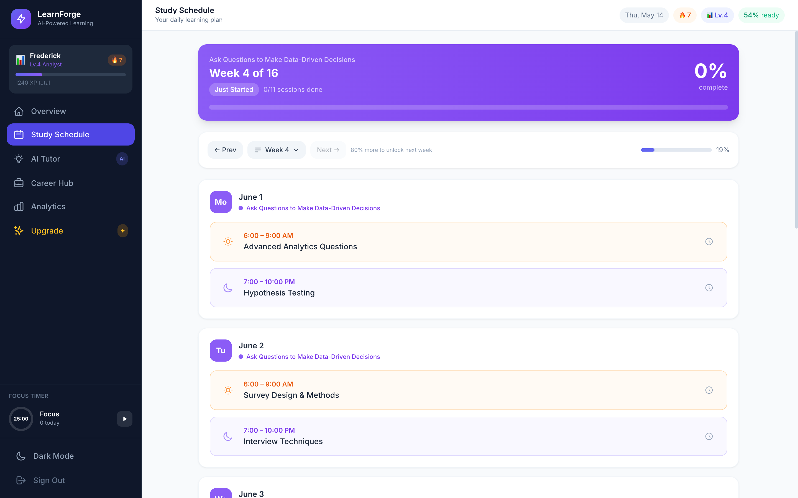
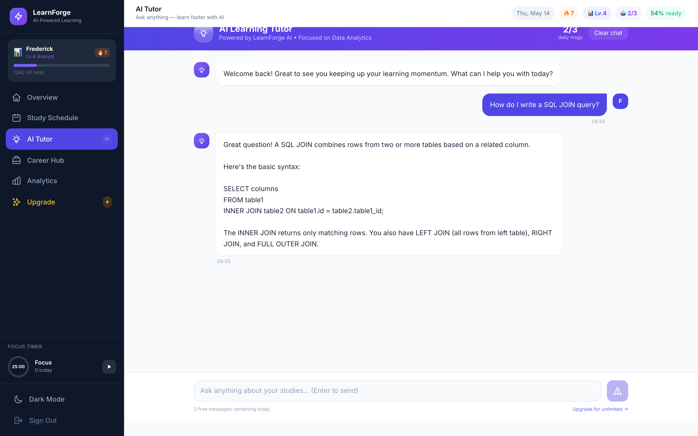
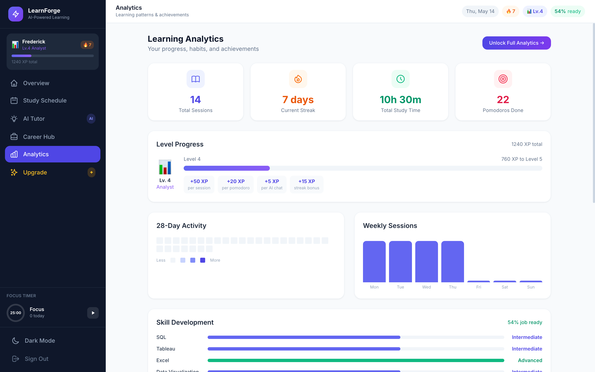
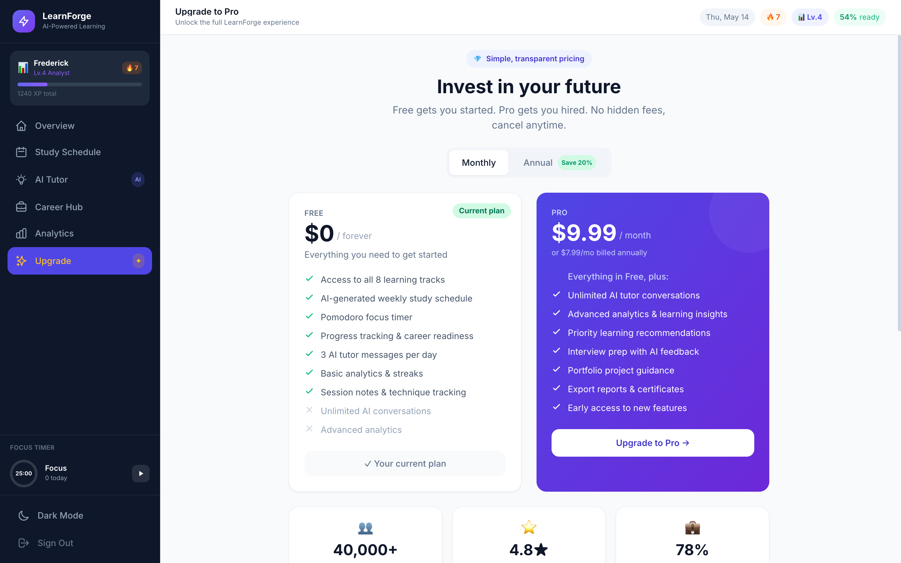

# LearnForge — AI-Powered Learning for Everyone

> **From zero to job-ready.** LearnForge is a full-featured, production-grade learning platform that uses AI to close the gap between wanting to learn and actually getting hired — for students, career changers, and anyone navigating the new AI era.



---

## Why LearnForge?

The rise of AI has made learning faster and cheaper than ever — but it's also made it harder to know *what* to learn, *how* to structure progress, and *when* you're actually ready for a job. Most people bounce between YouTube, courses, and tutorials with no clear path forward.

LearnForge fixes that with:

- **Structured learning tracks** across 8 high-demand career paths
- **An AI tutor** that answers questions in plain language — right inside the app
- **Career readiness scoring** that maps your skills to real job openings
- **Gamification** (XP, levels, streaks, achievements) to keep motivation high
- **A Pomodoro focus timer** built directly into the dashboard
- **A freemium model** — free to start, Pro for unlimited AI and advanced analytics

---

## Screenshots

### Onboarding
A guided 4-step setup picks your learning track, weekly hours, and study times — then generates your personalised plan.



---

### Dashboard (Light Mode)
Your daily command centre: week progress, study streak, career readiness score, today's sessions, and a live focus timer — all at a glance.


---

### Dashboard (Dark Mode)
Full dark mode support, toggled from the sidebar in one click.



---

### Study Schedule
Week-by-week sessions with morning and evening slots, module progress, and quick access to the focus timer. Advance to the next week once you hit 80%.



---

### AI Tutor
Ask anything — get clear, structured answers focused on your current learning track. Free users get 3 messages per day; Pro unlocks unlimited conversations.



---

### Learning Analytics
28-day activity heatmap, weekly session chart, skill development bars, career readiness circle, level/XP progress, and a full achievements grid.



---

### Pricing
Transparent freemium pricing. Free forever with core features; Pro at $9.99/month (or $7.99/month billed annually) for unlimited AI and advanced tools.



---

## Features

### Learning Tracks
8 curated career paths, each with structured weekly content:

| Track | Duration | Outcome |
|---|---|---|
| Data Analytics | 16 weeks | Junior Data Analyst |
| Web Development | 20 weeks | Junior Web Developer |
| Python & Machine Learning | 24 weeks | ML Engineer |
| UX Design | 14 weeks | UX Designer |
| Digital Marketing | 12 weeks | Digital Marketing Specialist |
| Cybersecurity | 18 weeks | Security Analyst |
| Business Analytics | 14 weeks | Business Analyst |
| Custom Path | AI-generated | Your own goal |

### AI Tutor
- Topic-aware responses focused on your chosen learning track
- Conversation history persisted across sessions
- Free tier: 3 questions/day — resets at midnight
- Pro tier: unlimited conversations
- Suggested prompts to get started quickly

### Career Readiness
- Real-time readiness score (0–100%) based on session progress
- Skill mapping against real job market data
- Salary potential and matched job count
- Priority skill recommendations
- Full career hub with job applications and interview prep tracker

### Gamification
- **7 XP levels**: Curious Learner → Explorer → Practitioner → Analyst → Expert → Master → Champion
- **XP rewards**: sessions (+50), pomodoros (+20), AI chats (+5), streaks (+15), difficulty bonuses
- **18 achievements** across four rarity tiers: Common, Rare, Epic, Legendary
- **Daily streaks** tracked automatically

### Focus Timer (Pomodoro)
- 25-minute focus / 5-minute break cycles
- Compact timer in the sidebar + full timer on the overview page
- Desktop notification support
- Pomodoro count tracked per day and all-time

### Subscription Model
- **Free**: full access to all 8 learning tracks, 3 AI messages/day, basic analytics
- **Pro ($9.99/mo or $7.99/mo annual)**: unlimited AI, advanced analytics, priority features
- Stripe-ready payment UI (connect your Stripe keys to go live)

---

## Tech Stack

| Layer | Technology |
|---|---|
| Framework | React 19 (Create React App) |
| Styling | Tailwind CSS v3 with custom design tokens |
| State | React Context API + `useLocalStorage` hook |
| Icons | Custom SVG icon library (no external icon package) |
| AI | Mock AI engine (keyword-matched responses) — swap for any LLM API |
| Persistence | `localStorage` (all data stored client-side) |
| Routing | Tab-based navigation (no React Router needed) |

---

## Getting Started

### Prerequisites
- Node.js 18+
- npm 9+

### Install & Run

```bash
git clone https://github.com/fredopoku/study-calendar-app.git
cd study-calendar-app
npm install
npm start
```

Open [http://localhost:3000](http://localhost:3000) — you'll be taken through the onboarding flow on first launch.

### Production Build

```bash
npm run build
```

The `build/` folder is ready to deploy to Netlify, Vercel, or any static host.

---

## Roadmap

- [ ] Real AI integration (OpenAI / Claude API)
- [ ] Stripe live payment processing
- [ ] User accounts and cloud sync
- [ ] Mobile app (React Native)
- [ ] Community features and study groups
- [ ] Certificate generation on track completion
- [ ] Employer-facing portfolio pages

---

## Deploying

The app is a standard Create React App build — deploy anywhere that serves static files:

**Netlify** — drag the `build/` folder into the Netlify UI, or connect the GitHub repo for auto-deploys.

**Vercel** — `npx vercel` from the project root.

**GitHub Pages** — set `"homepage": "https://fredopoku.github.io/study-calendar-app"` in `package.json`, then `npm run deploy`.

---

## License

MIT — built and owned by **Frederick Opoku Afriyie**.
